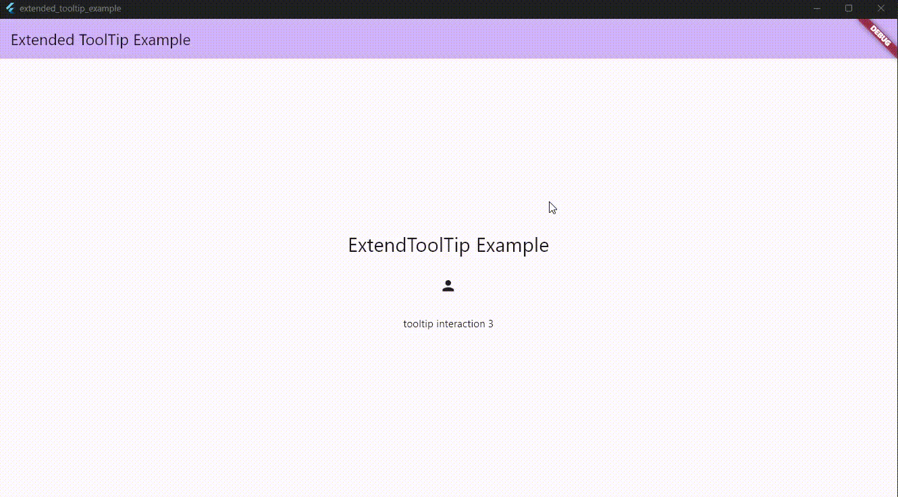

[](https://pub.dev/packages/extended_tooltip)

This package extends Tooltip option, giving the option to pass a Widget as tooltip.

This package uses Overlay to build the tooltip.

Dart Tooltip normally only accepts String or TextSpan, with this package you can extend this functionality by passing a Widget.

The tooltip position is calculated by checking the widget size and position relative to the screen.



## Usage

go to `/example` folder to more examples

```dart
ExtendedToolTip(
  horizontalPosition: ExtendedTooltipPosition.left,
  message: Container(
    width: 200,
    height: 200,
    decoration: BoxDecoration(
      borderRadius: BorderRadius.circular(10),
      color: Colors.red,
    ),
    child: const Center(child: Text('My custom Message')),
  ),
  child: Text(
    'ExtendToolTip Example',
    style: Theme.of(context).textTheme.headlineMedium,
            ),
```

```dart
ExtendedToolTip(
  message: IconButton(
    onPressed: () {
      setState(() {
        value++;
      });
    },
    icon: const Icon(Icons.add),
  ),
  child: Text('tooltip interaction $value'),
),
```
## Tested on
 * windows
 * web

Need to test on other plataforms
